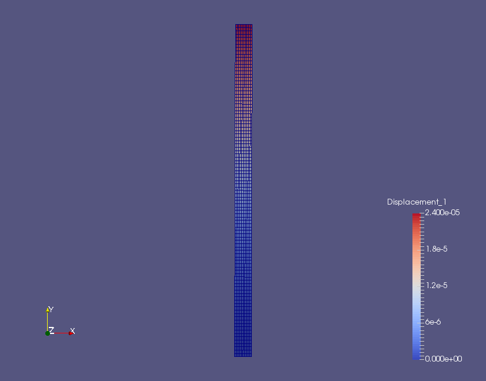

# Linear Elasticity

_Created by [Rubén Sánchez Fernández](https://github.com/rsanfer) on 24/10/2017_   
_Last edited by [Rubén Sánchez Fernández](https://github.com/rsanfer) on 30/10/2017_

As an initiation to the structural solver in SU2, we will first cover the solution of linear elastic problems. This tutorial will guide you through the construction of the configuration file, the basic commands for structural analysis, and the execution of the code.

First, make sure you have followed the [installation guide](https://github.com/su2code/SU2/wiki/Installation) and that you have SU2 up and running in your system. I personally recommend building the code from source. A [simple build](https://github.com/su2code/SU2/wiki/Simple-Build), for one core, will be enough for this tutorial.

The problem that we will be solving consists of a vertical cantilever, clamped in its base, and subject to a horizontal, distributed load $P$. This is shown in Fig. 1. The cantilever is H = 10 mm high and t = 0.5 mm thick, and it is discretized using 360 4-node quad elements with linear interpolation. 


## Static problems

We will first cover the solution of static problems. The mathematical problem that we will be solving has the well-known form  

$$\mathbf{K} \mathbf{u} = \mathbf{F},$$  

where $\mathbf{K}$ is the stiffness matrix of the cantilever, $\mathbf{u}$ is the vector of displacements of the structural nodes and $\mathbf{F}$ is the vector of applied forces.  

We start building the configuration file for SU2 (\*.cfg). First of all, we need to determine the physical problem that we will be solving. The keyword for structural problems is **ELASTICITY**, therefore

```
PHYSICAL_PROBLEM= ELASTICITY
```

Structural problems can undergo both geometrical and material non-linearities. In this tutorial, we will be assuming small deformations and linear elastic material behaviour. We set this as

```
GEOMETRIC_CONDITIONS= SMALL_DEFORMATIONS
MATERIAL_MODEL= LINEAR_ELASTIC
```

The structural properties are set through the Young's modulus, $E$, and the Poisson ratio $\nu$ of the structure, which in this case are set respectively to $E = 5.0$ GPa and $\nu = 0.35$. As the problem is solved in 2D, a plane stress assumption is imposed,

```
ELASTICITY_MODULUS=5.0E9
POISSON_RATIO=0.35
FORMULATION_ELASTICITY_2D = PLANE_STRESS
```

The configuration requires to input a mesh file. The mesh that we will be using in this problem is provided for download [here INSERT LINK](https://github.com/rsanfer/su2fsi), in SU2 format. The options to be added to the config file are

```
MESH_FORMAT= SU2
MESH_FILENAME= mesh.su2
```

It's now time to set the boundary conditions of the problem. We define the boundaries of our problem as


The load definition is, for this case, $P(y, t) = P = 1.0 \textrm{kPa}$. To comply with our linear elasticity assumptions, we define $P$ as a non-follower load, that is, the direction of the load remains constant throughout the simulation, in the x-axis (1, 0). This boundary condition is imposed in the boundary _left_ as

```
MARKER_LOAD= ( left, 1.0, 1000, 1, 0, 0)
```

where the ```1.0``` corresponds to the value of the load, and the ```1000``` is a multiplier to set the load in kPa. The direction of the load is finally set with the vector ```(1, 0, 0)```. Next, the clamped boundary is set as

```
MARKER_CLAMPED = ( clamped )
```

Finally, it is required that every other boundary in the problem has a boundary condition imposed. This is because SU2 was originally designed as a Finite-Volume CFD solver, and this imposes some constraints over the boundary description. Therefore, we set the remaining boundaries to have a zero pressure,

```
MARKER_PRESSURE= ( upper, 0, right, 0)
```

The equation $\mathbf{K} \mathbf{u} = \mathbf{F}$ is a linear system, which requires the use of the linear solvers implemented in SU2. There are several options available, and the choice depends on the particular properties of the problem being solved. In this case, we opt for a conjugate gradient solver with ILU preconditioner. The tolerance is set to 1E-8, and the number of iterations is fixed in 1000 to allow for the convergence of the solver.

```
LINEAR_SOLVER= CONJUGATE_GRADIENT
LINEAR_SOLVER_PREC= ILU
LINEAR_SOLVER_ERROR= 1E-8
LINEAR_SOLVER_ITER= 1000
```

Finally, the output of the solver needs to be set. The structural solver has been optimised to work with the open-source visualization tool [Paraview](https://www.paraview.org/). The Paraview-formatted output file will be written to _cantilever.vtk_ if the code is run in 1 core. If the problem is run in multiple cores, the solution will have to be reconstructed using SU2_SOL, which will be discussed at a later tutorial. The convergence file will be written as history.vtk, which in this case will only consist of one line as the linear problem is computed in a single iteration. The binary restart file will be saved as *restart\_cantilever.dat*.


```
OUTPUT_FORMAT= PARAVIEW
VOLUME_STRUCTURE_FILENAME= cantilever

CONV_FILENAME= history
RESTART_STRUCTURE_FILENAME= restart_cantilever.dat
```

#### Running the code

The config and mesh files are provided for download [here INSERT LINK](https://github.com/rsanfer/su2fsi). In order to run the code, please go ahead and download the files. Set yourself in the folder where the files are stored, and execute the code from the terminal as

```
SU2_CFD config.cfg
```

For this problem, the solver should run very quickly. The output of the code will go over your settings, before initializing the solver. Once done so, you will obtain an output such as

```
------------------------------ Begin Solver -----------------------------

 Iter    Time(s)    Res[Displx]    Res[Disply]      VMS(Max)
    0   0.011639      -9.587529      -9.607997    1.0540e+06
```

where ```Res[Displx]``` and ```Res[Disply]``` correspond to the residual of the linear solver in the x and y components of the displacements, and ```VMS(Total)``` corresponds to the maximum Von Mises Stress in the structural domain.

The output file, _cantilever.vtk_, can be opened with Paraview. It contains the displacements in x and y direction, the nodal tensions $\sigma_xx$, $\sigma_yy$ and $\sigma_xy$, and the Von Misses stress. In order to visualize the deformation of the cantilever, one can use the filter _Calculator_, where the displacement field is reconstructed as

```
Displacement_1*iHat+Displacement_2*jHat
```

and then applied to the structural field using the filter _Warp By Vector_. The solution of the problem is shown in Fig. 3.




## Dynamic problems

Next, we will incorporate dynamic conditions to the structural problem. The equation of the problem is now  

$$ \mathbf{M}\mathbf{\ddot{u}}+\mathbf{K}\mathbf{u}=\mathbf{F} $$

where structural damping effects have been neglected. We set the analysis to be dynamic using

```
DYNAMIC_ANALYSIS= YES

DYN_TIMESTEP= 0.01
DYN_TIME= 5.0
EXT_ITER=500

```

where the time step $\Delta t$ has been set to 10 ms, and the total time of the simulation is $T = 5$ s (500 time steps). We will be using the Newmark$^1$ method for time integration, which relies on the approximations  

$$\mathbf{u}^{t} = \mathbf{u}^{t-1} +  \Delta t \mathbf{\dot{u}}^{t-1} + [(\frac{1}{2} - \beta)\mathbf{\ddot{u}}^{t-1} + \beta \mathbf{\ddot{u}}^{t}] \Delta t^2$$

and

$$\mathbf{\dot{u}}^{t} = \mathbf{\dot{u}}^{t-1} + [(1 - \gamma)\mathbf{\ddot{u}}^{t-1} + \gamma \mathbf{\ddot{u}}^{t}] \Delta t,$$

to advance the problem in time. Further details about the implementation can be found in [this reference](https://arc.aiaa.org/doi/10.2514/6.2016-0205), available for download at [Spiral](https://spiral.imperial.ac.uk/handle/10044/1/28633). We will be introducing a 2% numerical damping, to damp out higher frequencies in the problem. This is done setting

```
TIME_DISCRE_FEA= NEWMARK_IMPLICIT
NEWMARK_BETA=0.2601
NEWMARK_GAMMA=0.52
```

We maintain the structural properties from the previous example. In dynamic problems, inertial effects are incorporated throught the mass matrix $\mathbf{M}$. Therefore, it is necessary to define the density of the material, which is done through the following option,

```
MATERIAL_DENSITY=1000
```

Finally, we define a sinusoidal load, $\mathrm{P}(t) = A \sin(2\pi f t+\phi)\mathrm{P}$, being $f$ the frequency of the sine wave in Hz, $A$ the amplitude and $\phi$ the phase angle in rad. This introduces some dynamic effects into the problem. We do so using 

```
SINE_LOAD= YES
SINE_LOAD_COEFF=(1.5, 2.0, 4.7124)
```

where ```SINE_LOAD_COEFF=``` ($A$, $f$, $\phi$). We have set a phase angle $\phi = -3\pi/2$ and an amplitude $A = 1.5$, which leads to a load $P(t) = -1.5P = -1.5 \textrm{kPa}$ at time $t=0$. The frequency is $f=2$ Hz, which leads to 10 full cycles of oscillation in our time span $T = 5$ s.


##### References
$^1$ Newmark, N.M. (1959), A method of computation for structural dynamics, _J Eng Mech Div_, 85(3):67-94

<dl>
<a rel="license" href="http://creativecommons.org/licenses/by/4.0/"></a><br />This work is licensed under a <a rel="license" href="http://creativecommons.org/licenses/by/4.0/">Creative Commons Attribution 4.0 International License</a>.
</dl>
